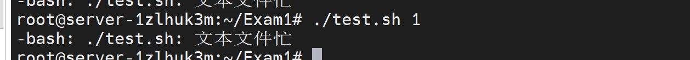
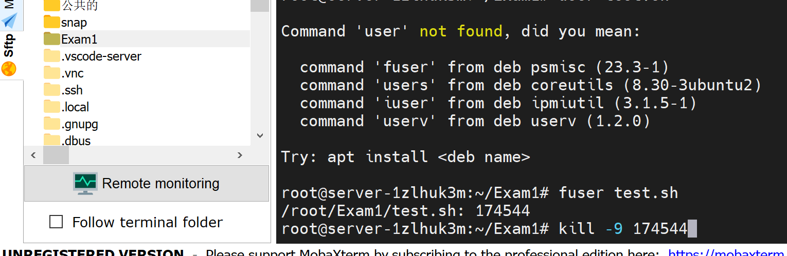
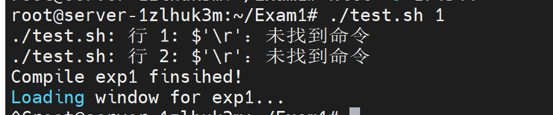
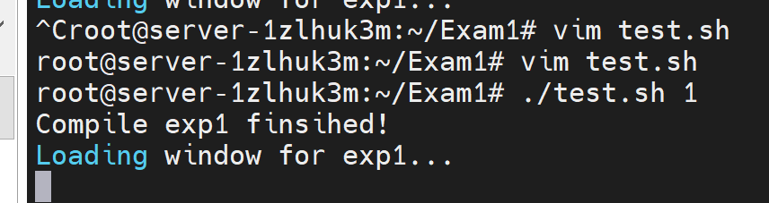
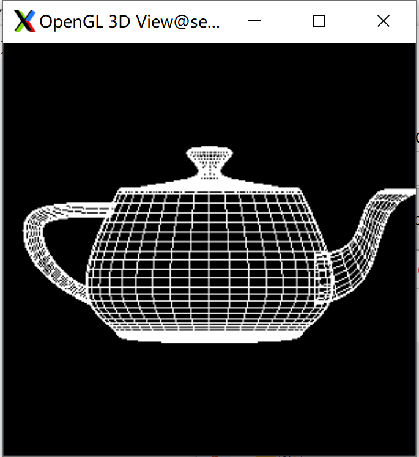
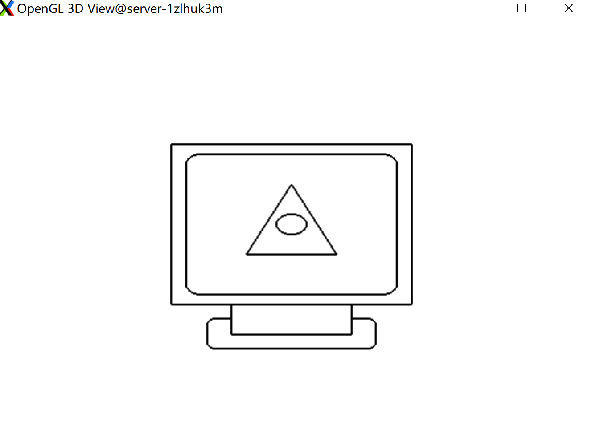
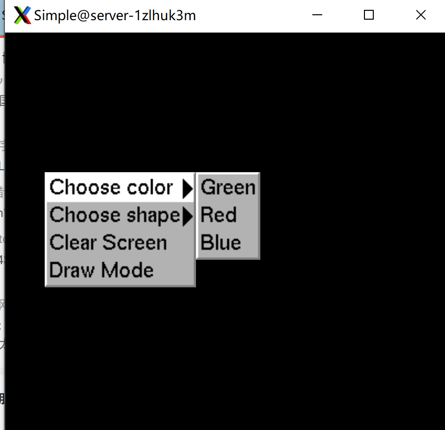
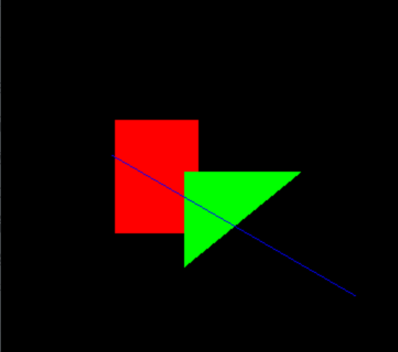

# EXAM 1说明文档

<center>
    2020K8009915008 林孟颖
</center>

[TOC]

## 1. 代码明细

由于在子文件夹中各个实验的源文件名称皆为`main.cpp`，故设置了一个通用的可执行脚本与子文件夹平行，具体使用方法见第三部分编译运行的说明。

各个实验的设计细节详见第四部分。

```
.
├── compile.sh				   # 用于编译的可执行脚本
├── test.sh				       # 用于运行实验的可执行脚本
|
├── Report1.pdf				   # 实验报告
│
├── p1_teaport                  # 实验1：测试环境配置
│   ├── main              	    # 可执行文件
│   └── main.cpp                # 实验1源文件
│
├── p2_screen                   # 实验2：基本图形绘制
│   ├── main              	    # 可执行文件
│   └── main.cpp                # 实验2源文件
│
├── p3_colorScreen              # 实验3：平面多边形区域填充
│   ├── main              	    # 可执行文件
│   └── main.cpp                # 实验3源文件
│
└── p4_draw                     # 实验4：交互控制绘制
    ├── main              	    # 可执行文件
    └── main.cpp                # 实验4源文件

```


## 2. 环境配置

无额外安装包。本地曾尝试在vscode+X11实现Linux的GUI显示，环境配置参考了如下资料：

[(3条消息) ssh+vscode remote显示x11_什么吃热狗的博客-CSDN博客_vscode x11](https://blog.csdn.net/weixin_44846677/article/details/120147771)

[(3条消息) VScode远程调试 - 利用RemoteX11+Xming显示GUI_EternalFlow的博客-CSDN博客](https://blog.csdn.net/info_black_hole/article/details/116378832?spm=1001.2101.3001.6650.7&utm_medium=distribute.pc_relevant.none-task-blog-2~default~BlogCommendFromBaidu~Rate-7-116378832-blog-120147771.pc_relevant_multi_platform_whitelistv3&depth_1-utm_source=distribute.pc_relevant.none-task-blog-2~default~BlogCommendFromBaidu~Rate-7-116378832-blog-120147771.pc_relevant_multi_platform_whitelistv3&utm_relevant_index=9)

后续发现此种方法时时发生`handshake timed out`，故转用Mobaxterm。

## 3. 程序编译与运行命令

### 3.1 仅编译程序

四个实验通用一个可执行脚本`compile.sh`，只需在使用时指定编译的实验号（如`./compile.sh 1`）:

```shell
cd *$1* && \
g++ main.cpp -lglut -lGLU -lGL -o main && \
cd .. && \
echo "Compile exp$1 finsihed!"
```

若希望直接用指令编译，只需在对应子文件夹下输入`g++ main.cpp -lglut -lGLU -lGL -o main`。

### 3.2 编译程序+运行实验

为方便起见，也提供编译和执行一体的脚本`test.sh`，同理只需指定实验号。其内容如下：

```shell
cd *$1* && \
g++ main.cpp -lglut -lGLU -lGL -o main && \
echo "Compile exp$1 finsihed!"
echo "Loading window for exp$1..."
./main
```

### 3.3 Bug记录

#### （1）可执行脚本忙

起初运行脚本时输出如下：



用如下指令查看使用该文件的进程并杀死占用该进程：

```
fuser test.sh
```



杀死该进程后侧栏断开连接，意识到Mobaxterm附带的侧栏目录功能会占用文件。

#### （4）shell文件末尾换行问题

运行时发现报错未找到命令：



查找资料得知这是在windows环境下编写Linux文件导致的：

> Unix体系里，每行结尾只有“<换行>”，即“\n”；
> Windows体系里面，每行结尾是“<换行><回 车>”，即“\n\r”。

解决方法如下：

- 使用vim打开文本文件

- 命令模式下输入

  ```
  :set fileformat=unix
  ```

- 保存退出

可见能正常运行：



## 4. 实验设计与效果

### 4.1 实验1：测试环境

运行测试用例后可正常显示茶壶模型平面图，可见环境配置正常：



### 4.2 实验2：基本图形绘制

#### （1）设计思路

参考课程ppt中给出的API，但做了如下改动：

- 将参数类型由`int`改为`double`类型，因OpenGL的坐标系是相对于屏幕中心作偏移，坐标的取值为`-1~1`。
- 实现`glRectSmooth`函数，其绘制圆角矩形，所需参数为：矩形的最小包围盒大小、圆角部分的圆半径、绘制的模式（可选`GL_LINE_LOOP`和`GL_POLYGON`）。
- 单独实现一个`glArcPoint`函数，只定义弧上散点，而不将其连接，因为有时候使用到圆弧时其可能只是一个闭合图形的一小部分，若每次都调用`glBegin`和`glEnd`，将无法正常填充封闭图形（如本次实验中的圆角矩形）。相应地，`glArc`只需调用之即可。

此外还需说明的是电脑基座的绘制方式，为支架实现“遮挡”底座的效果，一种思路是绘制底座时严格不穿过支架，但此种方式过于麻烦，未能很好地利用封装的函数；另一种较为简便的实现方式如下：

- 绘制一个圆角矩形当作底座；
- “擦除”圆角矩形穿过支架的部分（使用白色线段覆盖）；
- 绘制一个普通矩形当支架

注意2、3两步不可颠倒，否则支架与底座交界处会有一个白点。

#### （2）运行效果

运行结果如下：



### 4.3 实验3：平面多边形区域填充

#### （1）设计思路

在实验2的基础上做颜色填充，在如下网站查找色卡：

[RGB颜色对照表 (oschina.net)](https://tool.oschina.net/commons?type=3)

为使得代码阅读更友好，把所有使用到的颜色定义成宏，如下：

```c++
#define BLACK 0,0,0
#define WHITE 1,1,1
#define GREY    190.0/255, 190.0/255, 190.0/255
#define DIMGREY 105.0/255, 105.0/255, 105.0/255
#define GOLDEN  255.0/255, 215.0/255, 89.0/255
#define RED     205.0/255, 79.0/255,  57.0/255
#define BLUE    145.0/255, 206.0/255, 222.0/255
```

实验2描绘边框时使用的模式是`GL_LINE_LOOP`，而填色时需要将之修改为`GL_POLYGON`。本次实验总体采取先填色后描边的策略，唯一值得一提的是基座的填色与描边：

- 底座填色
- 底座描边
- 支架填色

支架描边与后续描边操作一起进行即可。

```c++
  // 基座
  glColor3f(DIMGREY);
  glRectSmooth(-0.28, -0.62, 0.28, -0.47, 0.03, GL_POLYGON);
  glColor3f(BLACK);
  glRectSmooth(-0.28, -0.62, 0.28, -0.47, 0.03, GL_LINE_LOOP);  // 基座的描线需特殊处理
  glColor3f(DIMGREY);
  glRect(-0.20, -0.55, 0.20, -0.40, GL_POLYGON);
```

#### （2）运行效果


### 4.4 实验4：交互控制绘制

#### （1）设计思路

本部分设计参考了课程ppt，做出的修改如下：

- 在绘制直线时加入了平滑操作（起初绘制结果中斜线锯齿十分明显）

  ```c++
  case 1:
              glBegin(GL_LINES);
              glEnable(GL_LINE_SMOOTH);   // 使直线更平滑
              glVertex2f(a[i*6], a[i*6+1]);
              glVertex2f(a[i*6+2], a[i*6+3]);
              glDisable(GL_LINE_SMOOTH);
              glEnd();
              break;
  ```

- 在清屏操作中将当前图元个数也清零。原代码中只是将Buffer清空，但下一次刷新时又会重新显示先前存储的图像，故在其中加入`num=0`的复位操作。

  ```c++
  if(value==2){
          num=0;  // 把原有图形清空
          glClear(GL_COLOR_BUFFER_BIT);
          glClear(GL_STENCIL_BUFFER_BIT);
          glFlush();
          printf("清屏\n");
      }
  ```

  

#### （2）运行效果



