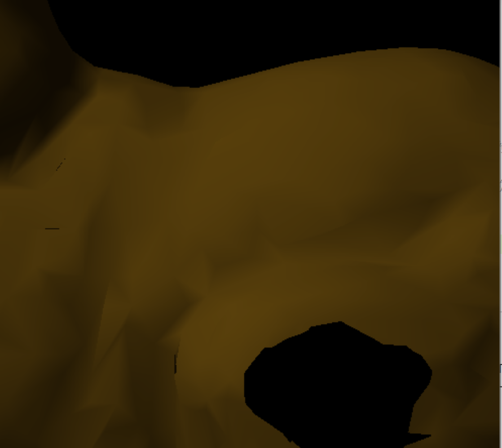
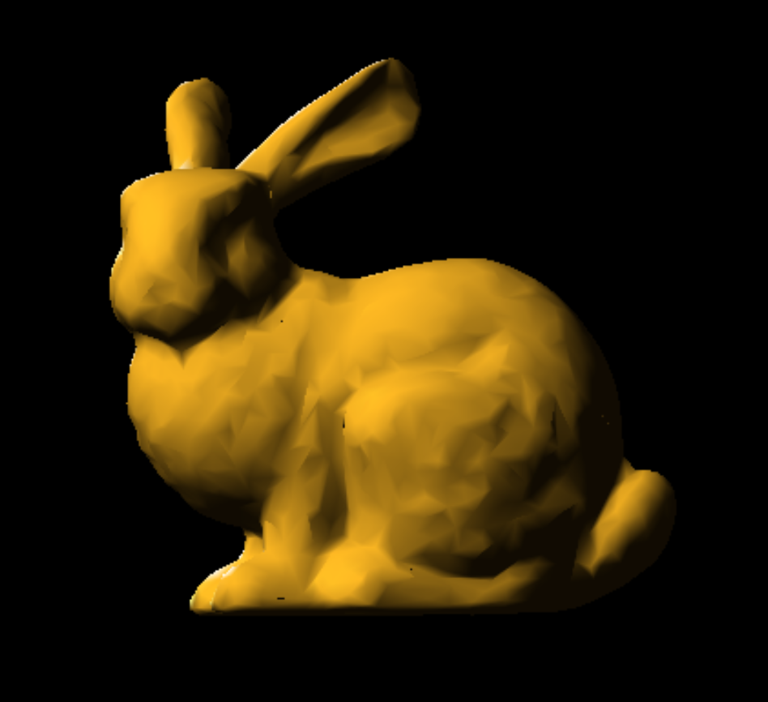
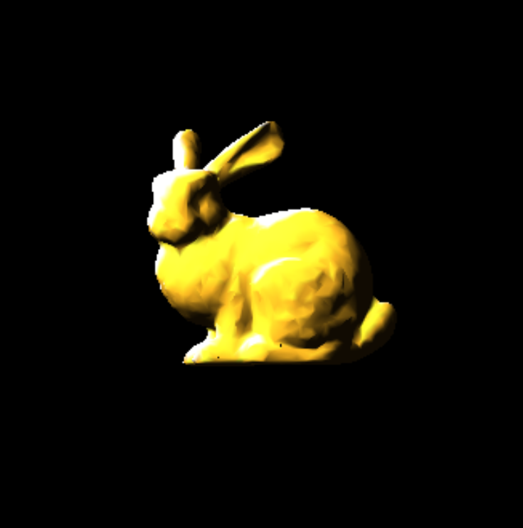
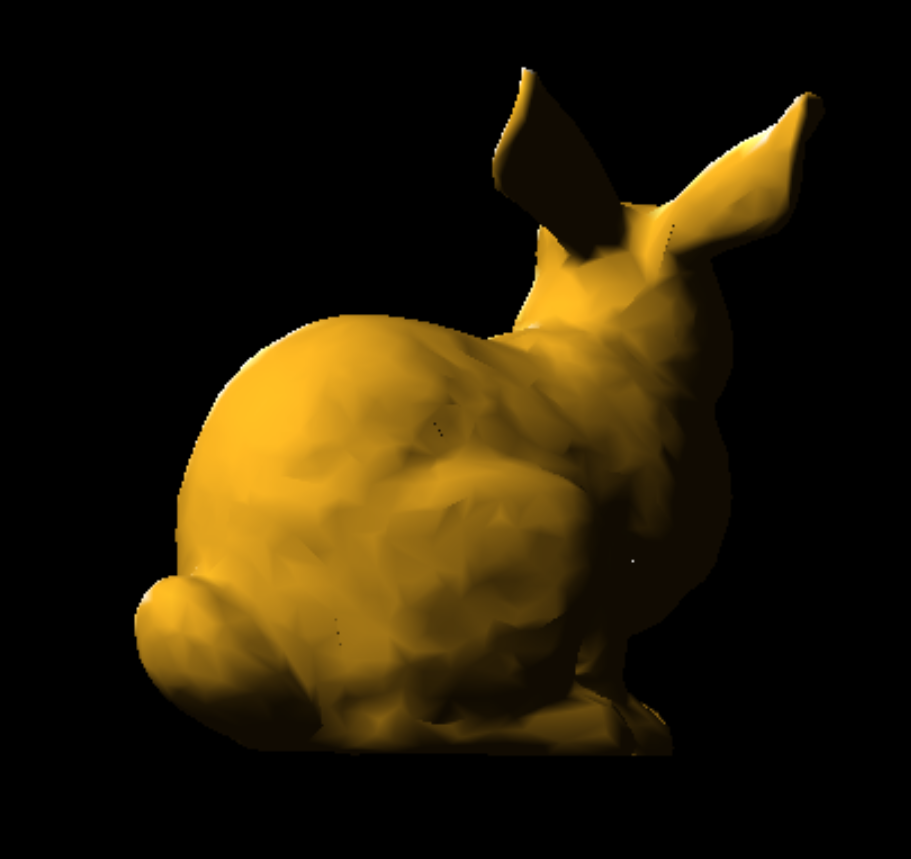
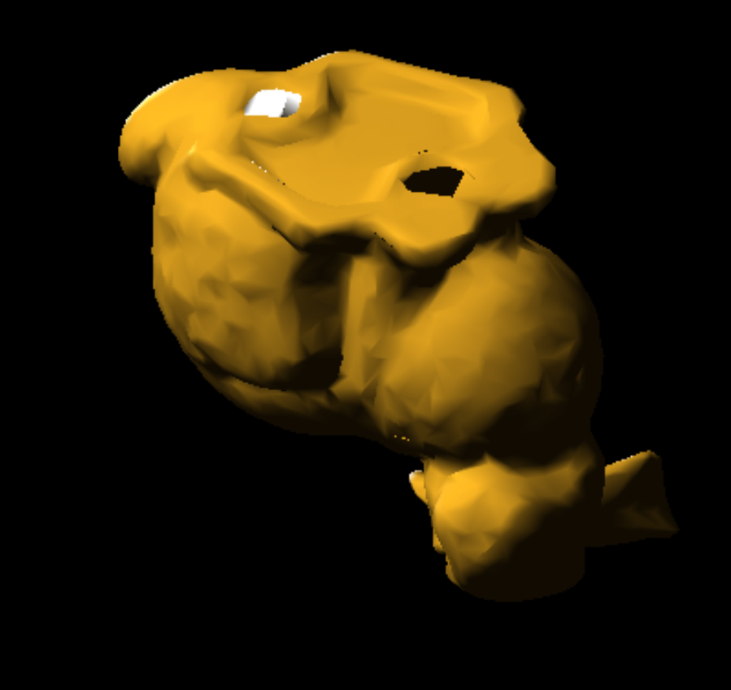

# EXAM 1说明文档

<center>
    2020K8009915008 林孟颖
</center>

[TOC]

## 1. 代码明细

实验的具体实现详见第2.2部分与第3部分。本次实验无需额外配置环境，故未对之做特别说明。

```
.
├── compile.sh				   # 用于编译的可执行脚本
|
├── Report2.pdf				   # 实验报告
|
├── bunny.obj				   # 实验使用待渲染的三维模型文件
│
├── main               	    	# 可执行文件
└── main.cpp                	# 实验源文件

```

运行可执行脚本`compile.sh`即可编译生成可执行文件`main`。

## 2. 背景知识

### 2.1 OBJ文件格式

常见的存储信息（加粗的为本次实验所用的文件包含的信息）：

- 顶点数据(Vertex data)：
      **v 几何体顶点(Geometric vertices)**
      vt 贴图坐标点(Texture vertices)
      **vn 顶点法线(Vertex normals)**
      vp 参数空格顶点 (Parameter space vertices)

- 自由形态曲线(Free-form curve)/表面属性(surface attributes):
      deg 度(Degree)
      bmat 基础矩阵(Basis matrix)
      step 步尺寸(Step size)
      cstype 曲线或表面类型 (Curve or surface type)

- 元素(Elements):
      p 点(Point)
      l 线(Line)
      **f 面(Face)**
      curv 曲线(Curve)
      curv2 2D曲线(2D curve)
      surf 表面(Surface) 

> 详细内容参见：[详解3D中的obj文件格式 - 简书 (jianshu.com)](https://www.jianshu.com/p/f7f3e7b6ebf5)

### 2.2 OpenGl鼠标与键盘交互

本部分的知识可参见：

> [(4条消息) OpenGL基础：glut处理鼠标事件(含滚轮输入)_chenjieping1995的博客-CSDN博客_opengl 鼠标事件](https://blog.csdn.net/jacky_chenjp/article/details/69396540)
>
> [(4条消息) openGL 键盘，鼠标响应事件应用_Dream_WHui的博客-CSDN博客](https://blog.csdn.net/dream_whui/article/details/39647169)

值得一提的鼠标实现缩放时，若缩放的倍数为负数时模型会倒置，故定义缩放下界`LOWER_BOUND`；而缩放倍数过大时模型渲染会出问题，如图：



同理定义缩放上界`UPPER_BOUND`。鼠标缩放时实现如下：

```c
// 鼠标左击缩小，右击放大，每次操作步幅为SCALE_GAP
void mouseClick(int button, int state, int x, int y) {
    if (button == GLUT_RIGHT_BUTTON && state == GLUT_DOWN) {
        if(scale>=UPPER_BOUND)
            printf("Reach the scale upper bound!\n");
        else
            scale += SCALE_GAP;
    }
    else if (button == GLUT_LEFT_BUTTON && state == GLUT_DOWN){
        if(scale<=LOWER_BOUND)    // 避免scale减小为非正值
            printf("Reach the scale lower bound!\n");
        else
            scale -= SCALE_GAP;
    }
    DrawScene();
}
```


### 2.3 平面法向量和顶点法线的计算

#### 2.2.1 平面法向量计算

已知三角形三个顶点为p1, p2, p3，则其法向量计算方法如下：


本次实验对应的代码实现如下：

```c++
f= &m_pic.F[i];
// step1 根据三个顶点计算平面法向量
v0 = m_pic.V[f->V[0]];
v1 = m_pic.V[f->V[1]];
v2 = m_pic.V[f->V[2]];
VECTOR3 v0_v1 = {v1.X - v0.X, v1.Y - v0.Y, v1.Z - v0.Z};
VECTOR3 v0_v2 = {v2.X - v0.X, v2.Y - v0.Y, v2.Z - v0.Z};
VECTOR3 fv =   {v0_v1.Y*v0_v2.Z - v0_v1.Z*v0_v2.Y,
                -v0_v1.X*v0_v2.Z + v0_v1.Z*v0_v2.X,
                v0_v1.X*v0_v2.Y - v0_v1.Y*v0_v2.X}; // 平面法向量（未归一化，含面积信息）
```

#### 2.2.2 顶点法线的计算

核心思想：对顶点所有关联面的法向量作平均，这种“平均”又有两种实现：

- 法一：对各个面的单位向量求平均，但这种方式几何上理解起来并不直观，有些**更大的面理应占有更大的权重**，因而我们引入了法二；
- 法二：对各个面的单位向量进行加权平均，权重即时各个面的面积信息，使用2.2.1中的方式计算的法向量本身就包含面积信息，因而我们无需做特殊处理。

遍历各面、将其法向量加到所有相关联的顶点上，即可使得顶点包含所有相关联面的信息：

```c
        // step2 将带权法向量加到每一个顶点的法向向量上
        m_pic.VN[f->N[0]].NX += fv.X;
        m_pic.VN[f->N[1]].NX += fv.X;
        m_pic.VN[f->N[2]].NX += fv.X;

        m_pic.VN[f->N[0]].NY += fv.Y;
        m_pic.VN[f->N[1]].NY += fv.Y;
        m_pic.VN[f->N[2]].NY += fv.Y;

        m_pic.VN[f->N[0]].NZ += fv.Z;
        m_pic.VN[f->N[1]].NZ += fv.Z;
        m_pic.VN[f->N[2]].NZ += fv.Z;    
```

求平均之后，我们还需对顶点的法向量做归一化，加速OpenGl的处理速度，只需遍历所有法向量并除以其范数：

```c
    // step3 遍历顶点，归一化顶点方向向量
    for(long long unsigned int i=0; i<m_pic.VN.size(); i++){
        vn = &m_pic.VN[i];
        norm = sqrt(vn->NX*vn->NX + vn->NY*vn->NY + vn->NZ*vn->NZ);
        vn->NX = vn->NX/norm;
        vn->NY = vn->NY/norm;
        vn->NZ = vn->NZ/norm;
    }
```


## 3. 实验设计与效果

本次实验的核心代码已在2.2.2中进行阐释，其余值得交代的便是控制使用自计算顶点向量的宏`CALC_NORMAL`，若编译时不定义该宏即会默认读取模型中的法向量，具体实现如下：

```c
...
            else if (s[1] == 'n') {
                istringstream in(s);
                vn = new Normal();
            #ifndef CALC_NORMAL
                string head;
                in >> head >> vn->NX >> vn->NY >> vn->NZ;
            #else
                vn->NX=vn->NY=vn->NZ=0;
            #endif
                m_pic.VN.push_back(*vn);
            }
...
    
void Initscene() {
    ReadPic();
#ifdef CALC_NORMAL
    CalcNormal();
#endif
    ...
```

为更好帮助用户判断是否使用了自计算的法向量，在计算函数中输出提示信息：

```c
void CalcNormal(){
    Face *f;
    POINT3 v0, v1, v2;      // 平面的三个顶点
    Normal *vn;
    double norm;
    cout<<"Calculating normals..."<<endl;
    ...
```

最终运行结果如下：








