# EXAM 3说明文档

<center>
    2020K8009915008 林孟颖
</center>

[TOC]

## 1. 代码明细

```makefile
│  Makefile
│  Report3.pdf
│
├─build							# 生成的可执行文件
│      main
│
├─input
│      dragon.obj
│
├─output						# 输出，*.obj是简化后的模型，*.log是输出记录
│      dragon0_25.log
│      dragon0_25.obj
│      dragon0_5.log
│      dragon0_5.obj
│      dragon0_75.log
│      dragon0_75.obj
│
└─src							# 源文件目录
        head.h					 # 头文件
        main.cpp				 # 主函数
        main.o
        show_model.cpp			  # 模型可视化的相关函数
        show_model.o
        simplify.cpp			  # 网格简化的相关函数
        simplify.o


```

`output`文件夹下存放的是输出，其后缀代表简化的比例。

## 2. 环境配置

本次实验使用了OpenMesh库，便于获取点、边、面关系，以及Eigen库，辅助矩阵计算。

### 2.1 OpenMesh在Linux中的配置

#### 2.1.1 安装

在官网下载openmesh的源码：

> https://www.graphics.rwth-aachen.de/software/openmesh/download/

右键安装链接（我选了zip）并复制，在终端输入：

```bash
wget https://www.graphics.rwth-aachen.de/media/openmesh_static/Releases/9.0/OpenMesh-9.0.zip
```

下载完毕后`unzip`解压，进入解压好的文件夹并make：

```bash
cd OpenMesh-9.0.0
mkdir build && cd build
cmake ..
```

出现`Configuring done`和`Generating done`后在当前目录的终端输入（可能会报错未安装Qt，无需管）：

```
make
```

> 如果想要开机多线程编译的话，加参数“-j [线程数量]”，例如make -j 4

等待编译完成后（进度为100%）输入如下以安装：

```bash
sudo make install
```

#### 2.1.2 建立项目

官网的指导书里已经给出如何使用Cmakelist.txt建立自己的项目：

> [OpenMesh: How to create your own project using OpenMesh (rwth-aachen.de)](https://www.graphics.rwth-aachen.de/media/openmesh_static/Documentations/OpenMesh-Doc-Latest/a05935.html)

但是这种方法过于麻烦，每次得把项目建立在`/src/OpenMesh/Apps`文件夹内，并在项目文件内编写`Cmakelist.txt`，后在外层的`Cmakelist.txt`中再加上我们的项目目录。考虑直接在g++编译时连接上库即可（安装OpenMesh时已经自动将库加入了`/usr/local/lib/`）。

使用官网给出的测试用例并使用如下命令编译：

```bash
g++ main.c -o main -lOpenMeshTools -lOpenMeshCore
```

这一步可能会报错：

```bash
error while loading shared libraries: libOpenMeshCore.so.9.0: cannot open shared object file: No such file or directory
```

> 可以使用whereis xxx查看该文件所处位置
>
> 下述命令每次登录都要输入，也可直接写入`/etc/bash.bashrc`，然后使用`source /etc/bash.bashrc `让之立刻生效。
>
> [(7条消息) 详解/etc/profile、/etc/bash.bahsrc、\~/.profile、\~/.bashrc的用途](https://blog.csdn.net/jirryzhang/article/details/70833544)

终端输入如下命令后可正常编译：

```bash
export LD_LIBRARY_PATH=/usr/local/lib/:$LD_LIBRARY_PATH
```

运行可执行文件后生成`output.off`，使用MeshLab查看：

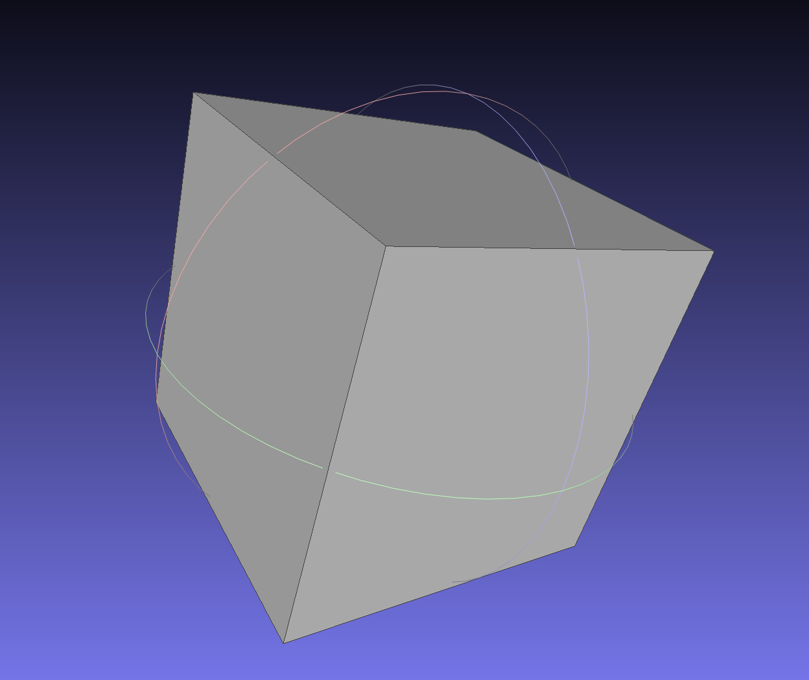

### 2.2 OpenMesh+Windows+Vscode环境的配置

> 不想下载VS，实在内存爆满……但是OpenMesh看上去真的很好用……
>
> 下载完后还是不建议Vscode+OpenMesh，环境搭建+项目创建可参考的文档实在太少，而且严重怀疑网上的可以找到的教程自己也没搭建成功……（也有可能是我运气太背，出了很多bug）

#### 2.2.1 直接下载built for VS的静态库

在vscode链接时总是报错，显示undefined reference：

```bash
PS D:\OpenGL_File> make all
g++ -std=c++17 -Wall -Wextra -g -Iinclude -o output\main.exe src/main.o  -Llib -lOpenMeshTools -lOpenMeshCore -lOpenMeshToolsd -lOpenMeshCored -lglad -lglfw3dll -lglut32 -lopengl32
src/main.o: In function `main':
D:\OpenGL_File/src/main.cpp:30: undefined reference to `OpenMesh::PolyConnectivity::add_face(std::vector<OpenMesh::VertexHandle, std::allocator<OpenMesh::VertexHandle> > const&)'
D:\OpenGL_File/src/main.cpp:37: undefined reference to `OpenMesh::PolyConnectivity::add_face(std::vector<OpenMesh::VertexHandle, std::allocator<OpenMesh::VertexHandle> > const&)'
D:\OpenGL_File/src/main.cpp:43: undefined reference to `OpenMesh::PolyConnectivity::add_face(std::vector<OpenMesh::VertexHandle, std::allocator<OpenMesh::VertexHandle> > const&)'
```

#### 2.2.1 自己下载source code编译（使用MinGW64-posix）

> 必须使用posix版本的MinGW，否则后续会出一摩尔奇奇怪怪的bug。

- cmake生成build文件夹

- 查看makefile得知使用cmd.exe运行make，管理员身份运行cmd，输入：

  ```bash
  mingw32-make
  ```

  解锁新报错：File too big

- 在`build\CMakeFiles\3.22.0-rc1`下找到`CMakeCXXCompiler.cmake`，第一行加上：

  ```makefile
  set(CMAKE_CXX_FLAGS ${CMAKE_CXX_FLAGS} "-O3") 
  ```

- 重复第二步即可

  ```bash
  -- Build files have been written to: D:/OpenMesh-9.0/OpenMesh-9.0.0/build
  Consolidate compiler generated dependencies of target OpenMeshCore
  [  1%] Building CXX object src/OpenMesh/Core/CMakeFiles/OpenMeshCore.dir/IO/BinaryHelper.cc.obj
  
  .....
  
  [ 90%] Building CXX object src/OpenMesh/Apps/mconvert/CMakeFiles/mconvert.dir/mconvert.cc.obj
  [ 92%] Linking CXX executable mconvert.exe
  [ 92%] Built target mconvert
  [ 94%] Building CXX object src/OpenMesh/Apps/VDProgMesh/mkbalancedpm/CMakeFiles/mkbalancedpm.dir/mkbalancedpm
  [ 96%] Linking CXX executable mkbalancedpm.exe
  [ 96%] Built target mkbalancedpm
  [ 98%] Building CXX object src/OpenMesh/Apps/VDProgMesh/Analyzer/CMakeFiles/Analyzer.dir/vdpmanalyzer.cc.obj
  [100%] Linking CXX executable Analyzer.exe
  [100%] Built target Analyzer
  
  D:\OpenMesh-9.0\OpenMesh-9.0.0\build>
  ```

- 然后把`build/src/OpenMesh/Tool`和`build/src/OpenMesh/Core`文件夹下生成的`.a`文件夹放到项目目录下，此后链接时加上`-lOpenMeshToolsd -lOpenMeshCored`即可

> 自己编译的生成的Windows下OpenMesh静态库都是带d的，但是本质上还是有debug和release之分，取决于build的时候是否定义-g，目前使用的是不带-g的release版本的静态库，不含debug信息，生成的可执行文件较小。

- 可以链接了，但无法运行

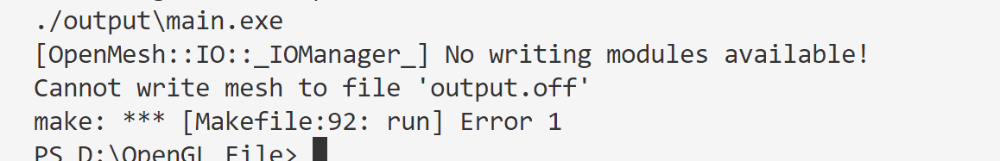

查看库文件：

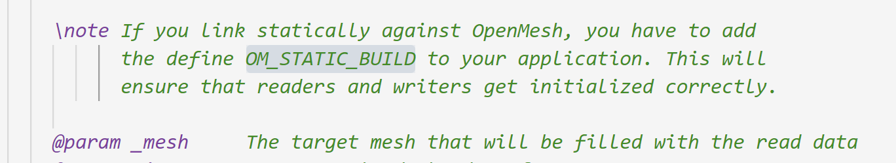

起初想在cpp_properties里定义该宏，但是不管用……在makefile中加上如下定义即可：

```make
CXXFLAGS	:= -std=c++17 -Wall -Wextra -g -DOM_STATIC_BUILD
```

### 2.3 Eigen库的使用

Linux：

```bash
sudo apt-get install libeigen3-dev
whereis eigen3
# 如果第2步输出结果是/usr/include，执行下述
sudo cp -r /usr/include/eigen3/Eigen /usr/include
# 如果第2步输出结果是/usr/local/include，执行下述
sudo cp -r /usr/local/include/eigen3/Eigen /usr/local/include 

```

Windows：

[Windows Eigen库下载安装并配置到VSCode - 知乎 (zhihu.com)](https://zhuanlan.zhihu.com/p/507347854)

[(7条消息) 安装和使用C++线性代数库eigen（Windows下minGW+VS code, VS2019配置方式）_beidou111的博客-CSDN博客_c++ eigen安装](https://blog.csdn.net/weixin_43940314/article/details/115456199)

## 3. 背景知识链接

附上一些我自己参考的链接，供后续自己查找使用：

[(7条消息) 【图形学】网格简化及边坍缩( Edge Collapse )算法_wk_119的博客-CSDN博客_edge collapse](https://blog.csdn.net/qq_31804159/article/details/111769328)

使用c++自带的堆排序API：

[C++ Algorithm make_heap()用法及代码示例 - 纯净天空 (vimsky.com)](https://vimsky.com/examples/usage/cpp-algorithm-make_heap-function-01.html)

[(7条消息) c++ make_heap(), pop_heap()函数_zhusf16的博客-CSDN博客_c++ pop_heap](https://blog.csdn.net/u012604810/article/details/80912794)

[C++的make_heap/pop_heap/push_heap用法 - NeoZy - 博客园 (cnblogs.com)](https://www.cnblogs.com/FdWzy/p/12487216.html)

后续还是用了快排（前期的初始化`O(nlogn)`）+ 插入排序（后续插入新边，由于原本的vector已经有序，只需`O(n)`）:

[插入排序及其复杂度分析 - JollyWing - 博客园 (cnblogs.com)](https://www.cnblogs.com/jiqingwu/p/insertion_sort_algorithm.html)

[(8条消息) 面试题（55）|STL（5）:vector删除指定值的元素_haimianjie2012的博客-CSDN博客_vector删除某个值](https://blog.csdn.net/haimianjie2012/article/details/118812615)

[(8条消息) vector的有序化操作_沙漠里的海豚的博客-CSDN博客](https://blog.csdn.net/zjl_1026_2001/article/details/2224502)

## 4. 运行方式&实验结果

### 4.1 Makefile的说明

编写了Makefile，重要参数如下：

- `RATIO`：修改待简化的比例；
- `INPUT`：输入文件的路径；
- `SRC`：指定源文件路径
- `LOG_NAME`：指定输出log的路径
- `OBJ_NAME`：指定简化后的模型的路径

命令说明：

- `make all`：创建必要的文件夹并编译链接生成可执行文件
- `make clean`：删除编译链接产生的`.o`文件和可执行文件
- `make run`：运行可执行文件（参数`EXE_ARGS`可在Makefile中修改）
- `make log`：运行可执行文件的同时将输出保存在output文件夹下的`.log`文件内。

```makefile
#
# 'make'        build executable file 'main'
# 'make clean'  removes all .o and executable files
#

# define the Cpp compiler to use
CXX = g++

# define any compile-time flags
CXXFLAGS	:= -std=c++17 -Wall -Wextra -g

# define library paths in addition to /usr/lib
#   if I wanted to include libraries not in /usr/lib I'd specify
#   their path using -Lpath, something like:
LFLAGS = 

# define source directory
SRC		:= src

# define relevant libs
LIBRARIES	:= -lOpenMeshTools -lOpenMeshCore -lglut -lGLU -lGL

# define flags used for excuting
RATIO	:= 0.25
INPUT	:= $(wildcard *.obj)
OUTPUT	:= output
PREFIX  := $(OUTPUT)/$(strip $(basename $(INPUT))$(subst .,_,$(RATIO)))
LOG_NAME:= $(addsuffix .log ,$(PREFIX))
OBJ_NAME:= $(addsuffix .obj ,$(PREFIX))
EXE_FLAGS := $(INPUT) $(OBJ_NAME) $(RATIO)

ifeq ($(OS),Windows_NT)
MAIN	:= main
SOURCEDIRS	:= $(SRC)
FIXPATH = $(subst /,\,$1)
RM			:= del /q /f
MD	:= mkdir
else
MAIN	:= main
SOURCEDIRS	:= $(shell find $(SRC) -type d)
FIXPATH = $1
RM = rm -f
MD	:= mkdir -p
endif

# define the C source files
SOURCES		:= $(wildcard $(patsubst %,%/*.cpp, $(SOURCEDIRS)))

# define the C object files 
OBJECTS		:= $(SOURCES:.cpp=.o)

#
# The following part of the makefile is generic; it can be used to 
# build any executable just by changing the definitions above and by
# deleting dependencies appended to the file from 'make depend'
#

OUTPUTMAIN	:= $(call FIXPATH,$(MAIN))

all: $(OUTPUT) $(MAIN)
	@echo Executing 'all' complete!

$(OUTPUT):
	$(MD) $(OUTPUT)

$(MAIN): $(OBJECTS) 
	$(CXX) $(CXXFLAGS) -o $(OUTPUTMAIN) $(OBJECTS) $(LFLAGS) $(LIBRARIES) 

# this is a suffix replacement rule for building .o's from .c's
# it uses automatic variables $<: the name of the prerequisite of
# the rule(a .c file) and $@: the name of the target of the rule (a .o file) 
# (see the gnu make manual section about automatic variables)
.cpp.o:
	$(CXX) $(CXXFLAGS) -c $<  -o $@

.PHONY: clean
clean:
	$(RM) $(OUTPUTMAIN)
	$(RM) $(call FIXPATH,$(OBJECTS))
	@echo Cleanup complete!

run: all
	./$(OUTPUTMAIN) $(EXE_FLAGS)
	@echo Executing 'run: all' complete!

log: all
	./$(OUTPUTMAIN) $(EXE_FLAGS) >>  $(LOG_NAME) 2>&1
	@echo Executing complete! Saving log at $(LOG_NAME)!

```

### 4.2 代码宏的说明

三个宏开关的作用：

- *SHOW_EDGE*：在渲染时是否显示网格边的信息

  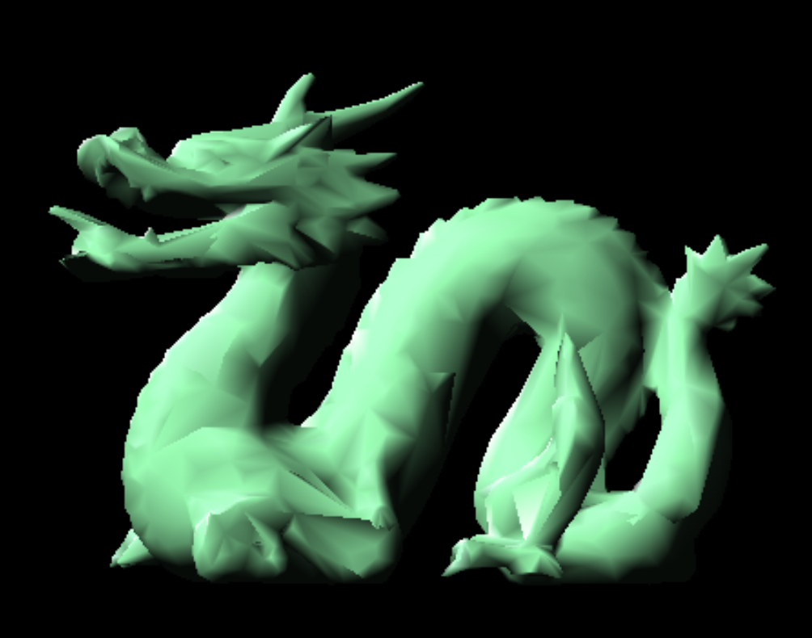

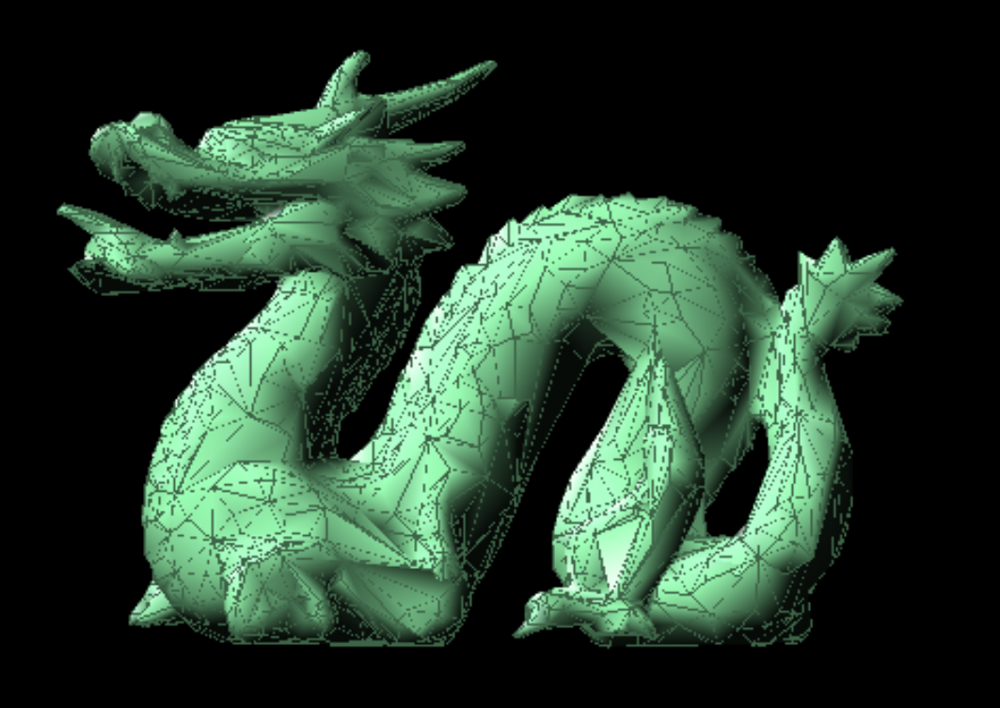

- *RE_CALC*：网格简化时是否实时更新参数.
- *DEBUG*：控制debug信息的输出

### 4.3 实验结果

在远程机上跑计算速度果然比在本机上快多了，查看训练的log可知CPU time都在3s左右，以下为简化0.25，0.5，0.75的实验运行示意图（MeshLab的查看详见5.3部分）：

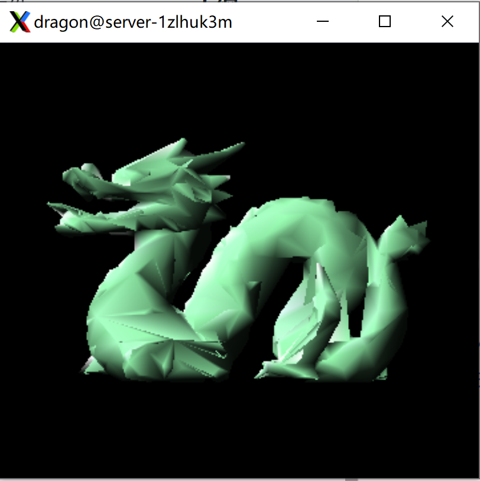

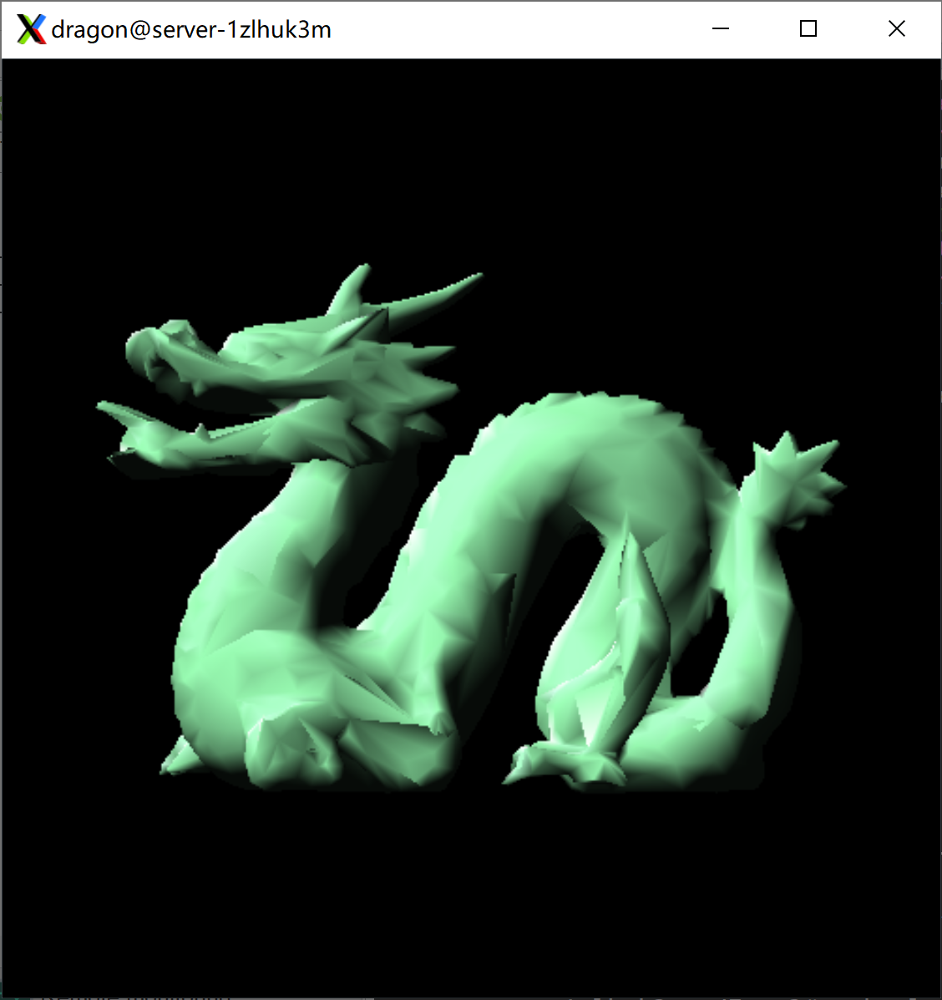


## 5. 附录. 疑难bug记录

### 5.1 前期：框架内报错？

> 从不能跑→能跑

console直接提示出错位置的bug就不提了，遇到一个找了很久的bug：

```shell
g++ -std=c++17 -Wall -Wextra -g -DOM_STATIC_BUILD -Iinclude -c src/main.cpp  -o src/main.o
make : In file included from include/OpenMesh/Core/IO/SR_binary_spec.hh:427,
所在位置 行:1 字符: 1
+ make all >> out.log 2>&1
+ ~~~~~~~~~~~~~~~~~~~~~~~~
    + CategoryInfo          : NotSpecified: (In file include...ry_spec.hh:427,:String) [], RemoteExcepti 
   on
    + FullyQualifiedErrorId : NativeCommandError
 
                 from include/OpenMesh/Core/IO/SR_store.hh:61,
                 from include/OpenMesh/Core/IO/MeshIO.hh:55,
                 from src/main.cpp:9:
include/OpenMesh/Core/IO/SR_binary_vector_of_bool.inl: In static member function 'static size_t OpenMesh:
:IO::binary<std::vector<bool> >::size_of(bool)':
include/OpenMesh/Core/IO/SR_binary_vector_of_bool.inl:9:30: warning: unused parameter '_store_size' [-Wun
used-parameter]
   static size_t size_of(bool _store_size = true) { return UnknownSize; }
                         ~~~~~^~~~~~~~~~~~~~~~~~
In file included from include/OpenMesh/Core/IO/MeshIO.hh:58,
                 from src/main.cpp:9:
include/OpenMesh/Core/IO/exporter/ExporterT.hh: In instantiation of 'OpenMesh::Vec3f OpenMesh::IO::Export
erT<Mesh>::point(OpenMesh::VertexHandle) const [with Mesh = OpenMesh::TriMesh_ArrayKernelT<>*; OpenMesh::
Vec3f = OpenMesh::VectorT<float, 3>]':
include/OpenMesh/Core/IO/exporter/ExporterT.hh:94:10:   required from here
include/OpenMesh/Core/IO/exporter/ExporterT.hh:96:37: error: request for member 'point' in '((const OpenM
esh::IO::ExporterT<OpenMesh::TriMesh_ArrayKernelT<>*>*)this)->OpenMesh::IO::ExporterT<OpenMesh::TriMesh_A
rrayKernelT<>*>::mesh_', which is of pointer type 'OpenMesh::TriMesh_ArrayKernelT<>* const' (maybe you me
ant to use '->' ?)
     return vector_cast<Vec3f>(mesh_.point(_vh));
                               ~~~~~~^~~~~
include/OpenMesh/Core/IO/exporter/ExporterT.hh: In instantiation of 'OpenMesh::Vec3d OpenMesh::IO::Export
erT<Mesh>::pointd(OpenMesh::VertexHandle) const [with Mesh = OpenMesh::TriMesh_ArrayKernelT<>*; OpenMesh:
:Vec3d = OpenMesh::VectorT<double, 3>]':
include/OpenMesh/Core/IO/exporter/ExporterT.hh:99:10:   required from here
include/OpenMesh/Core/IO/exporter/ExporterT.hh:101:37: error: request for member 'point' in '((const Open
Mesh::IO::ExporterT<OpenMesh::TriMesh_ArrayKernelT<>*>*)this)->OpenMesh::IO::ExporterT<OpenMesh::TriMesh_
ArrayKernelT<>*>::mesh_', which is of pointer type 'OpenMesh::TriMesh_ArrayKernelT<>* const' (maybe you m
eant to use '->' ?)
     return vector_cast<Vec3d>(mesh_.point(_vh));
                               ~~~~~~^~~~~
include/OpenMesh/Core/IO/exporter/ExporterT.hh: In instantiation of 'bool OpenMesh::IO::ExporterT<Mesh>::
is_point_double() const [with Mesh = OpenMesh::TriMesh_ArrayKernelT<>*]':
include/OpenMesh/Core/IO/exporter/ExporterT.hh:104:8:   required from here
include/OpenMesh/Core/IO/exporter/ExporterT.hh:106:47: error: 'OpenMesh::TriMesh_ArrayKernelT<>*' is not 
a class, struct, or union type
     return OMFormat::is_double(typename Mesh::Point()[0]);
                                               ^~~~~~~
```

查看报错的头文件：

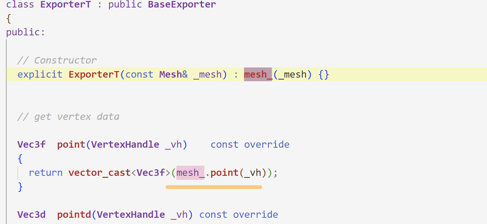

报错提示把如上位置改成`->`？不知道啥缘故无效debug了一下午，后来猜测是某些地方对mesh取了引用，惊奇地发现自己保存模型的时候：

```c
      if(OpenMesh::IO::write_mesh(&mesh, output_name))
        cout<<"Saving models with simplification ratio "<<c<<" at "<<output_name<<endl;
```

然而报错居然在最开始include头文件的地方，真的毫无提示性……

### 5.2 中期乱七八焦的结果

> 从不能看→能看

#### ver1

第一版简化网格的结果（SOS这是个啥）：

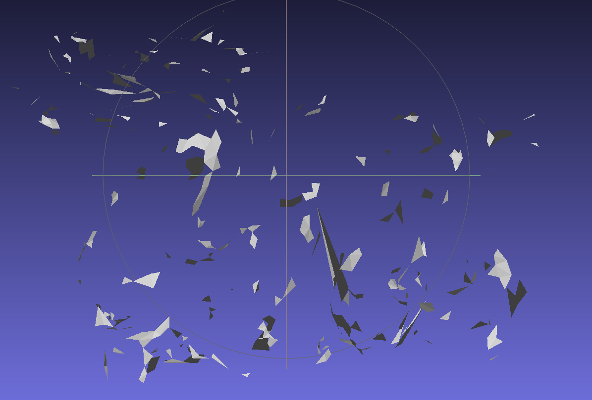

先前是这样删除的：

```c
  // 删除顶点对：一个顶点移动到目标位置，一个顶点直接删除
#ifdef DEBUG
  auto pi = mesh.point(pti);
  auto pj = mesh.point(ptj);
  auto newp = vbest.optimalv3;
  cout << "Deleting vertex "<<pi[0]<<","<<pi[1]<<","<<pi[2]<<endl;
  cout << "Deleting vertex "<<pj[0]<<","<<pj[1]<<","<<pj[2]<<endl;
  cout << "Adding vertex "<<newp[0]<<","<<newp[1]<<","<<newp[2]<<endl;
#endif
  mesh.set_point(pti, vbest.optimalv3);
  mesh.delete_vertex(ptj, true);  // 同时删除isolated的顶点
  mesh.garbage_collection();
}
```

查找资料得知Openmesh删除顶点同时删除了其关联的面，而不是像我所想的坍缩式的删除。

查找资料：

> [(7条消息) <2x6x2>OpenMesh译稿：使用并理解OpenMesh-边的折叠_feengg的博客-CSDN博客](https://blog.csdn.net/feengg/article/details/88367786)
>
> ```c
> 
> for(PolyMesh::HalfedgeIter it = mesh.halfedges_begin(); it != mesh.halfedges_end(); ++it) {
>   if( mesh.to_vertex_handle(*it) == vhandle[3] &&
>       mesh.from_vertex_handle(*it) == vhandle[2])
>   {
>     // Collapse edge
>     mesh.collapse(*it);
>     break;
>   }
> 
> ————————————————
> 版权声明：本文为CSDN博主「feengg」的原创文章，遵循CC 4.0 BY-SA版权协议，转载请附上原文出处链接及本声明。
> 原文链接：https://blog.csdn.net/feengg/article/details/88367786
> ```

OpenMesh的边坍缩好简单！！！参考上述进行边的折叠：

#### ver2

第二版结果：除了龙身上插了个剑好像没啥区别？

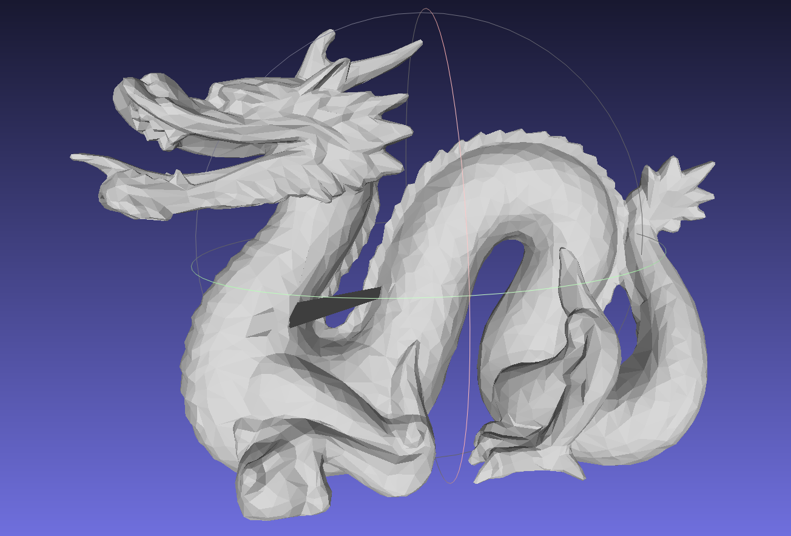

查看debug输出的部分log：

```
Adding vertex 0.12615,-0.125436,-0.182494
Deleting vertex 0.12615,-0.125436,-0.182494
Deleting vertex 0.12615,-0.125436,-0.182494
Adding vertex 0.12615,-0.125436,-0.182494
Deleting vertex 0.12615,-0.125436,-0.182494
Deleting vertex 0.12615,-0.125436,-0.182494
Adding vertex 0.12615,-0.125436,-0.182494
Deleting vertex 0.12615,-0.125436,-0.182494
Deleting vertex 0.12615,-0.125436,-0.182494
Adding vertex 0.12615,-0.125436,-0.182494
Deleting vertex 0.12615,-0.125436,-0.182494
Deleting vertex 0.12615,-0.125436,-0.182494
Adding vertex 0.12615,-0.125436,-0.182494
Deleting vertex 0.12615,-0.125436,-0.182494
Deleting vertex 0.12615,-0.125436,-0.182494
Adding vertex 0.12615,-0.125436,-0.182494
Deleting vertex 0.12615,-0.125436,-0.182494
Deleting vertex 0.12615,-0.125436,-0.182494
Adding vertex 0.12615,-0.125436,-0.182494
Deleting vertex 0.12615,-0.125436,-0.182494
Deleting vertex 0.12615,-0.125436,-0.182494
Adding vertex 0.12615,-0.125436,-0.182494
Deleting vertex 0.12615,-0.125436,-0.182494
Deleting vertex 0.12615,-0.125436,-0.182494
Adding vertex 0.12615,-0.125436,-0.182494
```

发现始终在操作一个顶点……难道是我的堆排序没写好？先用快排试试：

#### ver3

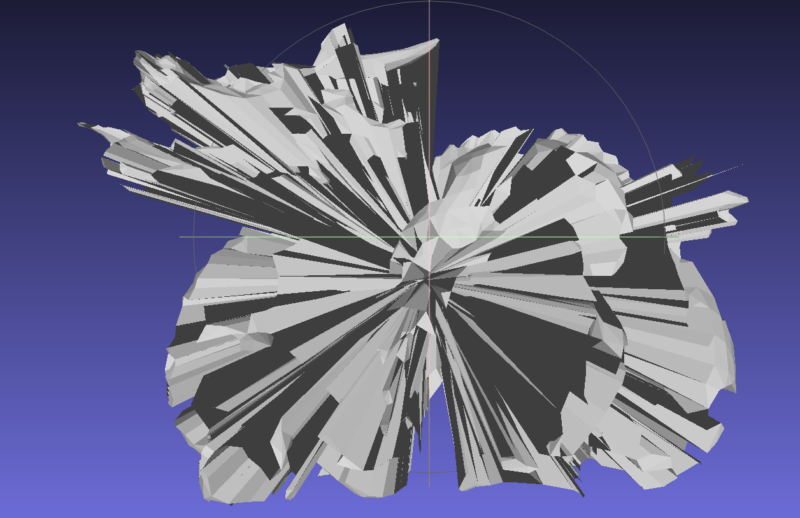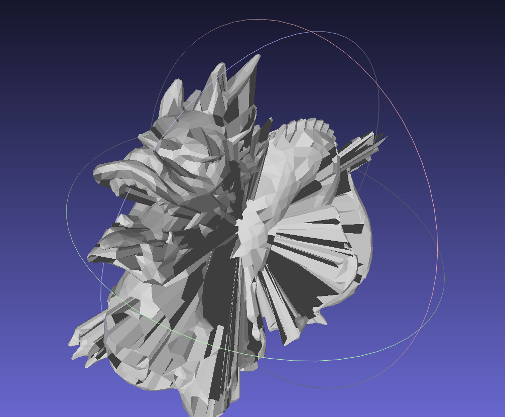

我是什么小天才……这铁定是cost算错了吧……查看输出的log：

```c
Deleting vertex -0.574691,-0.679231,0.27447 and -0.565817,-0.660899,0.234045 with cost 1226.75
New vertex 0.0166381,-0.129326,-0.100936
Deleting vertex -0.389779,0.411176,0.089304 and 0.0272417,-0.119989,-0.0973849 with cost 1226.8
New vertex 0.0100785,-0.130852,-0.102539
Deleting vertex 0.03984,-0.113225,-0.110968 and 0.297483,0.0895724,0.00408328 with cost 1227.58
New vertex -0.0164699,-0.114576,-0.108762
Deleting vertex 0.488356,-0.509266,-0.294363 and 0.499469,-0.515542,-0.270533 with cost 1231.62
New vertex 0.000772612,-0.127969,-0.109134
```

看上去新顶点的坐标算得不是很对……再输出计算Q值的信息：

```c
Q for 1: 6.83056e-317 2.56139e-316 6.83068e-317            0
2.72613e-317 6.83071e-317 8.33707e-315            0
2.56243e-316  5.9359e-310            0 6.83065e-317
           0 7.68707e-317 2.80285e-317 6.83071e-317
Q for 2: 6.83056e-317 2.56139e-316 6.83068e-317            0
2.72613e-317 6.83071e-317 8.33707e-315            0
2.56243e-316  5.9359e-310            0 6.83065e-317
           0 7.68707e-317 2.80285e-317 6.83071e-317
....
Q for 2713:  4045.35 -502.541  166.696  103.248
-502.541   4682.5  105.065  598.772
 166.696  105.065  5708.15  586.855
 103.248  598.772  586.855  2539.22
Normal for face 7681 -0.0398903,-0.986082,-0.161404
Vertex|normal:0.168149
Normal for face 7206 0.00933327,-0.916174,0.400671
Vertex|normal:0.0904672
Normal for face 6987 0.124901,-0.752815,0.646274
Vertex|normal:0.0927822
Normal for face 4661 0.420687,-0.616933,0.665144
Vertex|normal:0.250774
Normal for face 6653 0.455704,-0.727173,0.513375
Vertex|normal:0.31711
Q for 2714:  4045.75 -503.195  167.301  103.504
-503.195  4685.79  103.587  598.068
 167.301  103.587  5709.46  587.254
 103.504  598.068  587.254  2539.43
```

发现到后面Q值大得离谱，查看实现：

```c
    for(auto vh=mesh.vertices_begin(); vh!=mesh.vertices_end(); ++vh){  // vh:vertex handle
      Matrix4d tmpQ;
      auto vertex = mesh.point(*vh);  // 从句柄获得点
      // 遍历和目标顶点相邻的面，计算损失矩阵坐标
      for(auto v_fh = mesh.vf_begin(*vh); v_fh!=mesh.vf_end(*vh); v_fh++){  // v_fh：vertex相邻的face的handle
        Matrix4d Kp;
        auto normal = mesh.normal(*v_fh);
        // double tmp = -vertex[0]*normal[0]-vertex[1]*normal[1]-vertex[2]*normal[2];
        double tmp = -(double)(vertex|normal);
        MatrixXd plane(1,4);
        plane << normal[0], normal[1], normal[2], tmp;
      #ifdef DEBUG
        cout<<"Normal for face "<<*v_fh<<" "<<normal[0]<<","<<normal[1]<<","<<normal[2]<<endl;
        cout<<"Vertex|normal:"<<tmp<<endl;
      #endif
        Kp = plane.transpose() * plane;
        tmpQ += Kp;
      }
```

忘记把`tmpQ`置零了😇，修改后输出了终于成个龙样了！（而我已经不成人形）

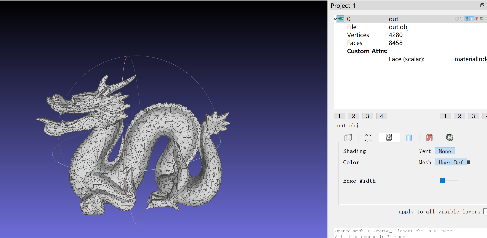

### 5.3 后期填坑

> 从顶点数目不对→差不多对了（吧）

但是可以注意到删除的顶点数并非一半，查看log意识到一对顶点对应的是两个半边，原本的代码将导致其被重复处理，先粗糙地处理一下：

```c
  while(total && myheap.size()){
    vbest = myheap.front();
    // 需要连续删除两个，一对顶点含两个半边
    myheap.erase(myheap.begin());
    myheap.erase(myheap.begin());
```

修改后报错：

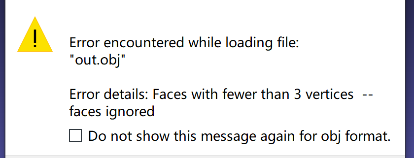

打开模型也可以看到明显的瑕疵：

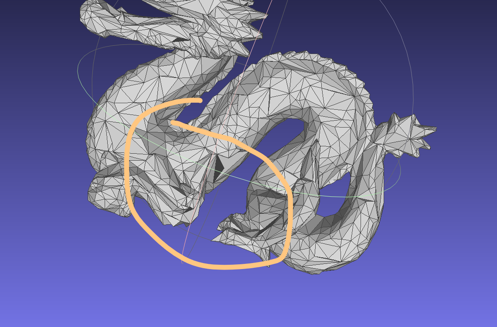

同时查看输出的log：

```
New vertex -0.434898,-0.671699,-0.0198724
Still have 183 vertex to delete
CPU time = 129
[After] Model get 2825 vertex in total
[After] Model get 5550 face in total
Saving models with simplification ratio 0.5 at out.obj
[OBJWriter] : write file
```

```c
while(total && myheap.size()){
```

意味着还没删够顶点，容器就空了，原因是做了顶点的坍缩后未修改容器中相邻顶点的信息，导致很多顶点被判定为无效。同时意识到我们要做的是边的处理，所以其实可以在定义的item结构体里存储边的信息而非一对顶点的信息。

更进一步的，正如我们可以将Q值信息作为顶点的属性，我们也可以将item作为边的属性，这样我们只需要使得item包含最佳坍缩位置的信息以及cost信息即可

#### 5.3.1 每次更新重新计算损失值

原先以为openmesh的property会自动更新（官网的文档说是dynamic），但事实上其“动态“指的应该是后续可修改而不是会根据值的变化而自己变化。查看增删前后的值，其cost值是不变的：

```c
Deleting 2641 vertex...
Deleting edge 500 with cost2.31946e-05
Deleting edge 3287 with cost6.15938e-05
Deleting edge 3288 with cost7.74933e-05
Deleting edge 14358 with cost0.000286518
Deleting edge 12327 with cost0.000209685
Deleting edge 12325 with cost1.66146e-05
Deleting edge 14741 with cost0.000120364
DEBUG 0
Adding edge 500 with cost2.31946e-05
Adding edge 3287 with cost6.15938e-05
Adding edge 3288 with cost7.74933e-05
Adding edge 14358 with cost0.000286518
Adding edge 12327 with cost0.000209685
Adding edge 12325 with cost1.66146e-05
Adding edge 14741 with cost0.000120364
Deleting edge 732 with cost8.44448e-05
```

报错位置：

```c
Deleting edge 15532 with cost1.14476e-05
Deleting edge 12541 with cost3.2176e-06
DEBUG 0
Adding edge 15532 with cost0.000161352
Adding finished.
Adding edge 4830 with cost6.06349e-05
Assertion failed!

Program: D:\OpenGL_File\output\main.exe
File: include/OpenMesh/Core/Utils/Property.hh, Line 197

Expression: size_t(_idx) < data_.size()
```

意识到进行边坍缩后部分边会变得无效，在进行插入的时候会导致cmp的过程出错，故修改cmp如下：

```c
bool myCmp(MyMesh::EdgeHandle e1, MyMesh::EdgeHandle e2){
    // 判断是否有效，若无效，不做任何处理，等后续erase
  if(!mesh.is_valid_handle(e1) || !mesh.is_valid_handle(e2))
    return 1;
  auto it1 = mesh.property(cost_v, e1);
  auto it2 = mesh.property(cost_v, e2);
  return it1.cost < it2.cost;
}

```

解锁新的报错：

```c
Deleting edge 2171 with cost0.000418824
Deleting edge 5823 with cost1.09167e-14
Deleting edge 3763 with cost2.30231
Deleting edge 243 with cost0.000418824
Deleting edge 4128 with cost0.000159495
Deleting edge 8592 with cost0.00048974
Deleting edge 1115 with cost0.000401914
Deleting edge 4173 with cost0.000443331
Deleting edge 4174 with cost0.000435546
DEBUG 0
Assertion failed!

Program: D:\OpenGL_File\output\main.exe
File: D:\OpenMesh-9.0\OpenMesh-9.0.0\src\OpenMesh\Core\Mesh\PolyConnectivity.cc, Line 733

Expression: (next_halfedge_handle(h1) == h0) && (h1 != o0)
```

查看提示处，其涉及collapse操作的具体细节：

```c
void PolyConnectivity::collapse(HalfedgeHandle _hh)
{
  HalfedgeHandle h0 = _hh;
  HalfedgeHandle h1 = next_halfedge_handle(h0);
  HalfedgeHandle o0 = opposite_halfedge_handle(h0);
  HalfedgeHandle o1 = next_halfedge_handle(o0);

  // remove edge
  collapse_edge(h0);

  // remove loops
  if (next_halfedge_handle(next_halfedge_handle(h1)) == h1)
    collapse_loop(next_halfedge_handle(h1));
  if (next_halfedge_handle(next_halfedge_handle(o1)) == o1)
    collapse_loop(o1);
}
...

    
void PolyConnectivity::collapse_loop(HalfedgeHandle _hh)
{
  HalfedgeHandle  h0 = _hh;
  HalfedgeHandle  h1 = next_halfedge_handle(h0);

  HalfedgeHandle  o0 = opposite_halfedge_handle(h0);
  HalfedgeHandle  o1 = opposite_halfedge_handle(h1);

  VertexHandle    v0 = to_vertex_handle(h0);
  VertexHandle    v1 = to_vertex_handle(h1);

  FaceHandle      fh = face_handle(h0);
  FaceHandle      fo = face_handle(o0);


  // is it a loop ?
  assert ((next_halfedge_handle(h1) == h0) && (h1 != o0));
..
    }
```

在上述`is it a loop ?`的检查中会出错。意识到使用v-e iterator遍历边的时候也应该检查边是否有效，同时查看官方文档得知在collapse操作前最好调用`is_collapse_ok`进行初步的检查。

修改后终于正常啦：

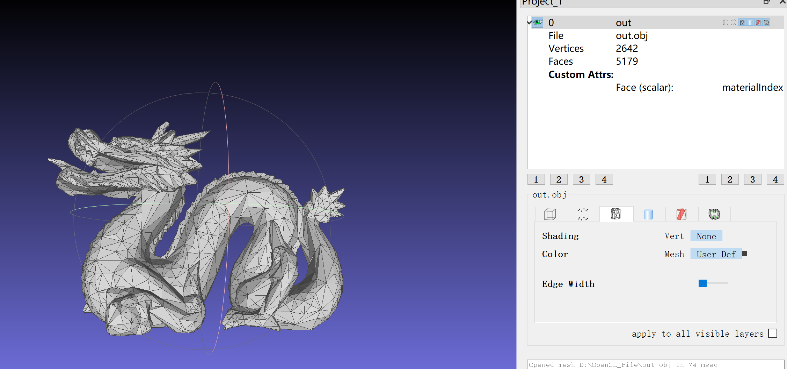

虽然这个结点数和老师给出的不完全一致，这大概是由于OpenMesh统计的结点数就有点不一样：

```bash
PolyMeshT::add_face: complex edge
PolyMeshT::add_face: complex edge
PolyMeshT::add_face: complex edge
Load model successfully
[Orig] Model get 5283 vertex in total
[Orig] Model get 10461 face in total
Adding q property...
Adding q property finished
Adding item property...
Adding item property finished
Sort 15704 edges in total
Deleting 2641 vertex...
Still have 0 vertex to delete
CPU time = 41
[After] Model get 2642 vertex in total
[After] Model get 5179 face in total
[OBJWriter] : write file
Saving models with simplification ratio 0.5 at out_0_5.obj

```

后询问助教得知由于不同点可能连接了不同面，只需保证比例大致正确即可。

#### 5.3.2 每次更新只删除无效边

边折叠后只删除无效点试试：

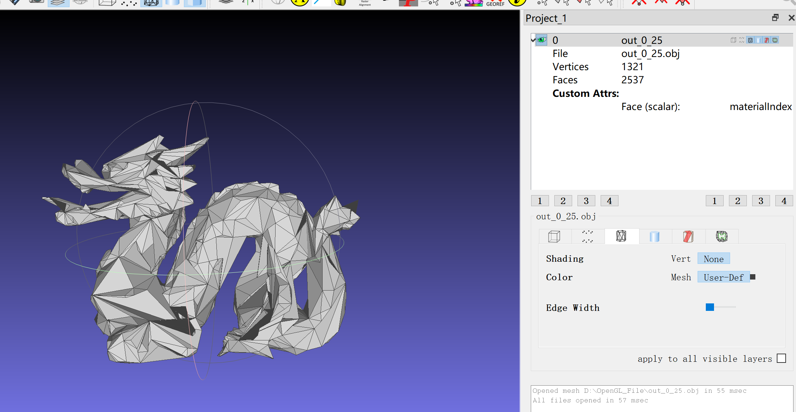

```c
.\output\main.exe : PolyMeshT::add_face: complex edge
所在位置 行:1 字符: 1
+ .\output\main.exe dragon.obj out_0_25.obj 0.25 >>out_0_25.log 2>&1
+ ~~~~~~~~~~~~~~~~~~~~~~~~~~~~~~~~~~~~~~~~~~~~~~~~~~~~~~~~~~~~~~~~~~
    + CategoryInfo          : NotSpecified: (PolyMeshT::add_face: complex edge:String) [], RemoteException
    + FullyQualifiedErrorId : NativeCommandError
 
PolyMeshT::add_face: complex edge
PolyMeshT::add_face: complex edge
PolyMeshT::add_face: complex edge
Load model successfully
[Orig] Model get 5283 vertex in total
[Orig] Model get 10461 face in total
Adding q property...
Adding q property finished
Adding item property...
Adding item property finished
Sort 15704 edges in total
Deleting 3962 vertex...
Still have 0 vertex to delete
CPU time = 41
[After] Model get 1321 vertex in total
[After] Model get 2537 face in total
Saving models with simplification ratio 0.25 at out_0_25.obj
[OBJWriter] : write file

```

再试试0.1会长什么样：

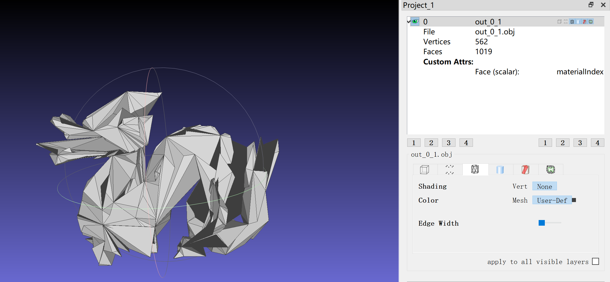

```bash
.\output\main.exe : PolyMeshT::add_face: complex edge
所在位置 行:1 字符: 1
+ .\output\main.exe dragon.obj out_0_1.obj 0.1 >>out_0_1.log 2>&1
+ ~~~~~~~~~~~~~~~~~~~~~~~~~~~~~~~~~~~~~~~~~~~~~~~~~~~~~~~~~~~~~~~
    + CategoryInfo          : NotSpecified: (PolyMeshT::add_face: complex edge:String) [], RemoteExce 
   ption
    + FullyQualifiedErrorId : NativeCommandError
 
PolyMeshT::add_face: complex edge
PolyMeshT::add_face: complex edge
PolyMeshT::add_face: complex edge
Load model successfully
[Orig] Model get 5283 vertex in total
[Orig] Model get 10461 face in total
Adding q property...
Adding q property finished
Adding item property...
Adding item property finished
Sort 15704 edges in total
Deleting 4754 vertex...
Still have 33 vertex to delete
CPU time = 43
[After] Model get 562 vertex in total
[After] Model get 1019 face in total
Saving models with simplification ratio 0.1 at out_0_1.obj
[OBJWriter] : write file

```

