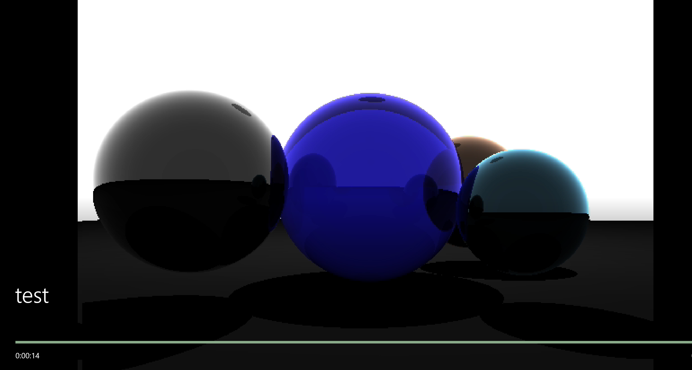

# EXAM 4说明文档

<center>
    2020K8009915008 林孟颖
</center>

[TOC]

## 1. 代码明细&环境配置

```makefile
│  Makefile
│  pic2v.py						# 图片拼接成video的helper
├─doc
│  exam_task.md					# 本次实验任务说明
│  Report4.pdf
│
├─build							# 生成的可执行文件
│      main
│
│
├─output						# 输出的图片&合成的视频
│      1.ppm
│      frame0.ppm
│      ...
│      frame419.ppm
│      pure_color.avi			 # 纯色渲染拼接的视频
│      texture.avi				# 带纹理渲染拼接的视频
│
└─src							# 源文件目录
        head.h					 # 头文件
        main.cpp				 # 主函数
        main.o
        show_pic.cpp			  # 模型可视化的相关函数
        show_pic.o
        trace.cpp			  	# 光线追踪的相关函数
        trace.o

```

下载`ffmpeg`：

```bash
apt install ffmpeg
```

## 2. 运行方式

### 2.1 Makefile的说明

编写了Makefile，重要参数如下：

- `SRC`：指定源文件路径
- `OUTPUT`：指定输出图片的路径

命令说明：

- `make all`：创建必要的文件夹并编译链接生成可执行文件
- `make clean`：删除编译链接产生的`.o`文件和可执行文件
- `make run`：运行可执行文件

### 2.2 代码宏的说明

```c
#define SAVE_PIC 0   // 生成单张图片
#define SAVE_ANIM 1   // 保存动画原始帧
#define LIVE_PIC 2   // 实时渲染单张图片（可交互）
#define LIVE_ANIM 3  // 实时渲染动画

#define MODE SAVE_ANIM
```

通过控制`MODE`宏选择不同功能。

> NOTE：如果要制作视频，建议将`ROTATE_GAP`设置得小一点，如`M_PI/60`，视频较为流畅。

```c
#define ADD_TEXTURE
```

控制该宏控制是否添加纹理。

### 2.3 实验结果

在远程机上跑计算速度果然比在本机上快多了，查看训练的log可知CPU time都在3s左

## 3. 实现思路&效果展示

### 3.1 实现鼠标缩放

前期跑出来的图像倒置，且颜色不对：


意识到模式没选对：

```c
    glDrawPixels(WIDTH, HEIGHT,GL_BGR_EXT, GL_UNSIGNED_BYTE, img_buf);
```

应该修改为`GL_RGB`，同时存储时std_image是从图片的最后一行进行存储。 所以在显示图片的时候需要将图片进行翻转，可以在计算时就对yy进行修改，如下：

```c
        float yy = (2 * ((y + 0.5) * invHeight) - 1) * angle;
```

可正确显示，且可控制视角缩放：


### 3.2 实现键盘控制旋转

二维的case：


[(9条消息) 三维空间的绕轴旋转变换_keneyr的博客-CSDN博客_三维空间绕坐标轴的旋转变换](https://blog.csdn.net/keneyr/article/details/88352702)

约定转动是相对于红色球的转动，且只有绕x、y轴的转动（z垂直向屏幕内，x竖直向上），旋转效果：


### 3.3 实现动态旋转并导出视频

实时显示只需要将绘制窗口的图像改为死循环即可，每次更新sphere的坐标。

opengl并没有直接导出视频的方法，可考虑将之逐帧导出ppm，后续拼接成视频。使用如下命令：

```c
ffmpeg -framerate 30 -start_number 0 -i frame%d.ppm -vcodec copy  test.avi
```

>  [ffmpeg中acodec与vcodec可设定值 - 远洪 - 博客园 (cnblogs.com)](https://www.cnblogs.com/liyuanhong/articles/14246512.html)
>
>  [opengl - 从OpenGL渲染帧创建视频  (stackoom.com)](https://stackoom.com/question/1lPho)

要命的是视频中发生了rgb反转：



即使手动指定`vcodec`为`ppm`也不奏效，再加上`-pixel_format rgb24`也不奏效，查看输出视频格式：


发现被转换成的bgr24，，，后来去掉解码器的设置反倒是可以了（我也不懂为啥）：


但是变得好模糊……

`ffmpeg -i test.avi`查看此时的编码格式：


最后拼接使用的命令行：

```c
ffmpeg -framerate 30 -start_number 0 -i frame%d.ppm  test.avi
```

最后还是用python去做了视频的拼接，清晰度勉强凑合的情况保持色彩不变。

### 3.4 实现纹理贴图

具体就是根据光线与球交点和圆心的向量计算出其纹理坐标，相应地修改surfaceColor即可。查找资料得知MIT搞了一个开源的工具库`stb`，可以将图片读成rgb数组。

> [stb-image: C 语言开发的一个简单易用的图像读取解析库，也是 Duilib 上用到的图像解析库 (gitee.com)](https://gitee.com/mirrors/stb-image)

刚开始看上去很暗：


修改一下透明度让光线尽可能透过得多一点：


好看是好看了，但是计算得真的很慢……再让其自发光：


同样可以使用宏控制模式并制作视频，但是这个算得实在太慢了……但是目前纹理是不会跟随球体旋转而旋转的，在计算纹理坐标时再加上旋转角信息：

```c
    // 获取纹理坐标
    // double phi = atan2(r_vec.z, r_vec.x);
    // double theta = asin(r_vec.y);
    double phi = atan2(r_vec.z, r_vec.x) + FLOAT_MOD(y_rotate, M_PI);
    double theta = asin(r_vec.y) + FLOAT_MOD(x_rotate, M_PI);
    double u = 1-(phi + M_PI) / (2*M_PI);
    double v = (theta + M_PI/2) / M_PI;
```

同时加上背景贴图（其实就是加上了和中心圆共圆心的大球）：


好丑哇……还不如纯色，ps修一下背景素材对比度：


> 主要参考资料（这是个好东西！）：
>
> [Ray Tracing: The Next Week](https://raytracing.github.io/books/RayTracingTheNextWeek.html)
>
> 其他参考资料：
>
> [HDRIs • Poly Haven](https://polyhaven.com/hdris)
>
> [OpenGL光照2：材质和光照贴图 - zhxmdefj - 博客园 (cnblogs.com)](https://www.cnblogs.com/zhxmdefj/p/11365819.html)
>
> [(9条消息) 《用一周学习光线追踪》5.球面纹理贴图__gamer的博客-CSDN博客](https://blog.csdn.net/masilejfoaisegjiae/article/details/105804301)
>
> [maijiaquan/ray-tracing-with-imgui: 本项目参考自教程《Ray Tracing in One Weekend》，使用CPU多线程加速，结合ImGUI显示渲染结果。 (github.com)](https://github.com/maijiaquan/ray-tracing-with-imgui)

